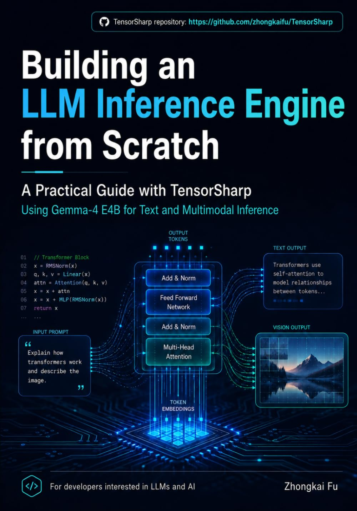

# TensorSharp

<p align="center">
  
</p>

[English](README.md) | [中文](README_zh-cn.md)

**面向 GGUF 模型的原生 .NET LLM 推理引擎** —— 覆盖自回归 LLM *与* DiffusionGemma 风格的文本扩散模型，以及 Qwen-Image-Edit 图像编辑、MiniMax-H3 视频 + 原生 32 kHz 立体声音频联合生成（Wan 2.1/2.2 则只生成视频）。提供控制台应用、浏览器聊天界面，以及兼容 Ollama/OpenAI 的 HTTP API。一个纯 .NET 引擎，在相同 GGUF 文件与相同 GPU 上与手工优化的 C++ `llama.cpp` 互有胜负。

## 《From Tensors to Tokens》—— TensorSharp 实战书籍

<p align="center">
  <a href="https://www.amazon.com/dp/B0H9P44QZZ">
    
  </a>
</p>

Zhongkai Fu 所著的 **[From Tensors to Tokens: Building a Multimodal LLM Inference Engine from Scratch with TensorSharp and Gemma 4 E4B](https://www.amazon.com/dp/B0H9P44QZZ)** 将本仓库串成一条端到端的学习路径。全书以 Gemma 4 E4B 为示例，连接张量基础、模型执行、多模态输入，以及一个可运行 LLM 推理引擎的应用接口。

**[查看书籍介绍与仓库伴读路线](docs/BOOK_zh-cn.md)** · **[在 Amazon 购买平装本](https://www.amazon.com/dp/B0H9P44QZZ)**

## 亮点功能

- **⚡ 与 llama.cpp 互有胜负——用纯 .NET 做到。** 在相同 GGUF 文件、相同 GPU 上，TensorSharp 在关键负载上追平乃至超越 `llama.cpp`：Gemma 4 E4B 与 2-bit 量化的 Qwen 3.6 35B-A3B MoE 在 CUDA 上 prefill 快 **1.28×**、首 token 早 **1.27×**（多轮最高 **1.49×**）；Gemma 4 12B 在 Vulkan 上 decode 快 **1.21×**（长上下文最高 **1.32×**）。→ [性能数据](#性能数据)
- **🚀 连续批处理 & 分页 KV 缓存。** vLLM 风格的分页 KV 池，支持基于内容哈希的前缀共享与迭代级调度器，服务端默认启用。分页池的字节常驻主机内存，因此它买到的是内存效率与前缀复用，而不是随并发增长的吞吐。→ [深入文档](docs/PAGED_ATTENTION_AND_CONTINUOUS_BATCHING_zh-cn.md)
- **🧬 DeepSeek V4 Flash（284B MoE），三套整模型执行器。** 这套压缩稀疏注意力、1M 上下文的架构可运行在 Direct CUDA 引擎（`--backend cuda`）、原生 ggml 执行器（`--backend ggml_cuda` / `ggml_vulkan`），以及 **100% 纯 C# 的 CPU 执行器**（`--backend cpu`，零原生依赖）上。权重会自动按层切分到所有可见 GPU，因此远大于单卡显存的模型依然跑得起来；服务端以原生 per-sequence slot + 连续批处理托管它。→ [DeepSeek V4 卡片](docs/models/deepseek4.md)
- **🧠 GLM-5.2（744B-A40B MoE），支持张量并行与 CPU MoE offload。** Multi-head Latent Attention，外加一个 DeepSeek 稀疏注意力的 "lightning indexer"，由它挑出每个 query 可以看的那 2048 个已缓存 token。`--tp N` 让每一层都跑在每张 GPU 上（head 按列/行并行，每个专家按行切开），`--cpu-moe` 则把路由专家——占 checkpoint 的 92%——留在系统内存里。默认的按层切分与 `--cpu-moe` 在同后端下与 llama.cpp 逐 token 一致；`--tp` 是把各 rank 的局部和相加，在 2 bit MoE 上这点最后一位的差别会传到 top-8 路由，几乎并列的 token 可能不同。3× RTX PRO 6000 上的正面对比：**pp2048 918.9，llama.cpp 为 763.1 tok/s**；tg64 43.7 对 42.2。自报的 1M 上下文（约 93 GiB 的 KV）是上限而非承诺——权重落盘之后，加载器会按实际空闲的显存来定上下文并打印它的选择（按层切分 342,272 token，`--n-cpu-moe 30` 为 646,400）；设 `MAX_CONTEXT` 则把某个长度变成硬性要求。→ [GLM 卡片](docs/models/glm_zh-cn.md)
- **🧠 GLM-5.3-Flash（320B MoE），decode 达 llama.cpp 的 2.0×。** 混合架构的后继者——288 个路由专家，45 层主干中有 34 层用 KDA 线性注意力，另外 11 层是 NoPE MLA + DSA 并配一个*池化*索引器（先在 4 格一池上取 top-k 2048，再展开到池内成员），以及 Sinkhorn 超连接 ×4——它通过与 GLM-5.2 完全相同的原生执行器与同一个 `GlmDsaModel` 加载。2× RTX PRO 6000 Blackwell（96 GB）、GLM-5.3-Flash-UD-Q2_K_XL（101 GiB）、按层切分、两个引擎均设 `n_ubatch` 2048，背靠背实测：**tg64 73.5 tok/s，llama.cpp 为 36.6**；prefill 双方相差不过几个百分点（pp2048 2014 对 2070，pp16384 1692 对 1690，pp32768 1446 对 1483）。视觉由 `mmproj-BF16.gguf`（GLM-OCR ViT）提供：`--image`、多图与多轮图像会话。跨所有可见 GPU 的按层切分、`--cpu-moe` / `--n-cpu-moe` 与原生 per-sequence slot 均可用；`--tp` 张量并行会被明确拒绝（请改用按层切分），NextN/MTP 投机解码则尚未实现。它现在也能跑在 100% 纯 C# 的 `--backend cpu` 路径上（仅文本），但在那里明显落后于 GGML 后端——prefill 约为 `ggml_cpu` 的 1/5.7、decode 约为 1/2.4；其 prefill logits 与 `ggml_cpu` 的余弦相似度为 0.9567，接近但**并未被证明**仅仅是 2 bit 量化敏感性所致，因此请把这条路径当作用于 A/B 对照的参考实现，而不是逐比特一致。→ [GLM 卡片](docs/models/glm_zh-cn.md)
- **⚡ Qwen 3.8 Flash Next——整个 token 一张图。** 一个混合 MoE：48 层中有 36 层是 GatedDeltaNet 递归层，与全注意力层交错（其中一部分还要过 Qwen 稀疏注意力的索引器），外加 PLE n-gram 嵌入块、×4 超连接流，以及 512 个专家（每步激活 10 个）。嵌入、图内 PLE、全部 48 层、最后的 mixer 与 LM head 以（几乎）**每个 token 一张捕获图**的方式运行，取自按形状索引的图缓存；视觉沿用 Qwen3.5-VL 视觉塔与 (T,H,W) IMRoPE，支持多图与多轮图像会话，并在轮次之间复用 KV（只能向后延伸——GDN 的递归状态无法回退）。`--tp N` 在这里跑的是**按层切分**而不是张量并行：2× A100-80GB 上，Qwen3.8-Flash-Next-UD-Q2_K_XL（73.4 GiB）分别占用两张卡的 24.2 GB 与 26.2 GB，prefill 约 1520–1550 t/s、decode 约 56 tok/s，与单卡持平，贪心输出也与单卡逐字节一致——买到的是容量而不是速度。→ [Qwen 3.8 Flash Next 卡片](docs/models/qwen38-flash-next_zh-cn.md)
- **🔮 投机解码——四种算法共用一套草稿-验证运行时。** 多 token 预测草稿头加速单序列 decode：Qwen 3.6（NextN 块内嵌于主干——需使用保留该块的 GGUF，例如 [unsloth/Qwen3.6-35B-A3B-MTP-GGUF](https://huggingface.co/unsloth/Qwen3.6-35B-A3B-MTP-GGUF)；基础仓库的同名文件已剥离该块）、**GLM 5.2**（NextN 块已随官方 checkpoint 一同分发，无需额外下载；2× RTX PRO 6000 + `--n-cpu-moe 20` 实测 decode **约 1.3×**，草稿接受率 94%）与 Gemma 4（独立 `gemma4-assistant` 草稿 GGUF，`--draft-model`）；DeepSeek V4 则新增 **DSpark** 块级起草（`--draft-model`），每步提议一整块 token，decode 提速 **1.3–1.4×**（多轮对话最高 2.0×）。第四种算法完全不需要训练权重：`--spec-type ngram` 用序列自身的后缀去匹配它已经见过的 token，因而在**任何**检查点上都可用——在本身不带草稿头的 Qwen3.5-9B 上实测 **45.2 tok/s 对普通 decode 的 31.4（1.44×）**（Q8_0、`ggml_metal`、M5 Pro），输出逐字节一致。以上都是草稿提议、主干一次批量前向验证，输出与标准 decode 一致。默认关闭；内嵌于主干的草稿头在两端均以 `--spec` 开启，而给出 `--draft-model` 文件本身即可启用投机。→ [投机解码](FEATURES_zh-cn.md#投机解码)
- **🔗 张量并行与分布式集群。** 用 `--tp N` 把一个模型切分到多张 GPU 上——Direct `cuda` 后端**以及** GGML CUDA / Vulkan 后端均支持——再用点对点 TCP 集群（`--tp-node-id` / `--tp-peers`）扩展到多台机器。采用 Megatron-LM 列/行并行范式与分层 AllReduce；GGML 上提供 MoE 专家并行与按 rank 的 GatedDeltaNet 融合内核。融合式按 rank 执行让 Gemma 4 E4B 上 `--tp 2` 的 decode 达到单卡的 **1.39×**、Muse-Glimmer 30B 达到 **1.57×**（其 prefill 同时提升 **1.34×**——是这里唯一在两个阶段都超过单卡的模型），也让单卡装不下的模型（Qwen 3.5-35B-A3B；24 GB 卡上 28.2 GB 的 Muse-Glimmer 30B Q8_0）得以运行。本身不切分任何权重的架构则把同一个 `--tp N` 当作**按层切分**来跑——每张 GPU 拿一段连续的整层（Qwen 3.8 Flash Next；DeepSeek V4 与 GLM 5.x 默认就是按层切分）——买到的是容量而不是速度；两种模式都不支持的架构现在会在 stderr 上明说，并改用单卡运行，而不是默不作声地让其余 GPU 闲着。可选 Redis 支撑的 KV 缓存与 Responses API 存储。→ [张量并行](USAGE_zh-cn.md#张量并行与分布式推理)
- **🎨 Qwen-Image-Edit 图像编辑。** 提示词 + 输入图像 → 编辑后的图像，驱动 60 块 MMDiT，配以 Qwen-Image VAE 与 Qwen2.5-VL-7B 文本编码器。CUDA 图捕获的整 DiT、FlowMatch-Euler true-CFG 去噪、Web UI 实时预览，以及 [Lightning 蒸馏 LoRA](https://huggingface.co/lightx2v/Qwen-Image-Edit-2511-Lightning) 快速路径（`--qwen-image-lora`，以运行期旁路的形式挂在原封不动的量化权重旁），把默认的 30 步 × CFG——即 60 次 DiT 前向——降到 **4** 次。热态 4 步编辑比 `stable-diffusion.cpp` 快 **1.19×**。→ [Qwen-Image-Edit 卡片](docs/models/qwenimage_zh-cn.md)
- **🎬🔊 MiniMax-H3 音视频联合生成。** 提示词 → 视频 **+ 原生 32 kHz 立体声音轨**，两者一起生成而不是事后配音：同一个 193 亿参数的扩散 Transformer 在一条 token 序列里对打包的“视频+音频”潜变量去噪，最长 15 秒、24 fps。支持文生视频、图生视频（照片成为第一帧，提示词驱动运动）、首尾帧变换，以及独立的 Ref2VA 检查点上的参考生视频——最多九个参考，可任意混合静图（`--ref-image`）、片段（`--ref-video`，片段自带的音轨用 `--ref-video-audio`）与独立音轨（`--ref-audio`），每个参考在共享时间轴上占据生成片段之前的一段，因此人物或产品的特征保留下来，而机位、背景和构图完全由提示词决定。以上全部无需 CFG，相对 20 步的默认值只需 4–8 步。七张原生 ggml 整图——50 层 Qwen3-VL-32B 文本编码器及其 27 层视觉塔与 DeepStack 注入、打包潜变量 DiT（含习得的 AdaLN 曲线表与三轴浮点 RoPE）、纯 Transformer 视频 VAE（36 层，无反卷积）、以及无混叠 BigVGAN 音频 VAE。帧数对齐到 `17k+5` 网格（5、22、39、56、73、90……），且**任意网格长度都能正确解码**——视频 VAE 每次跑 5 个潜变量帧、带 2 帧前瞻并对接缝做交叉淡化；同时 `h3_attend` 会按 key 数取一个 2 的幂预先缩放 V，使长片段那条无掩码的双向注意力（107 帧时 8646 个打包 token，22 帧时为 2364）在 ggml 的 FP16 flash-attention 累加器里保持有限——在此修复之前，107 帧的片段会返回全黑画面与被削平的音频。在 M5 Pro（`ggml_metal`）上端到端比 `stable-diffusion.cpp` 快 **2.4 倍**（256×256）与 **1.7 倍**（640×384）；而在 16 GB 的 RTX 3080 Laptop（`ggml_cuda`）上端到端反过来由 `stable-diffusion.cpp` 领先——256×256 快 1.15×、640×384 快 1.07×——但*逐去噪步*仍是 TensorSharp 更快（3.325 秒对 3.338 秒），差距全在固定的启动开销上，其中约 3 秒是 H.264 编码与 .NET 进程启动，而不是推理。每个网络都对着参考实现校验：文本编码器 cos 0.999999、DiT cos 0.998、两个 VAE cos 1.000000 / 0.99999。CLI（`--image`、`--end-image`、`--ref-image`、`--video-mode`、`--no-audio`；音轨作为旁挂 `.wav` 写在 MP4 旁边）、`/api/video-generate`、`/v1/videos/generations`，以及两份自动下载的配置——[`config/minimax-h3-fl2va.json`](config/minimax-h3-fl2va.json) 与 [`config/minimax-h3-ref2va.json`](config/minimax-h3-ref2va.json)——它们会取回全部四个网络（约 33.5 GB；两份配置之间只有去噪器不同）并逐个加载、逐个释放，因此显存峰值是其中最大的一个而不是四者之和。以上全部也能跑在 100% 纯 C# 的 `--backend cpu` 路径上——文生视频、图生视频、首尾帧与参考条件——它与原生 ggml 路径高度吻合，但并非逐比特一致。→ [MiniMax-H3 模型卡](docs/models/minimax-h3_zh-cn.md)
- **🎬 Wan 2.1 / 2.2 视频生成——仅视频（文本→视频、图像→视频）。** MiniMax-H3 之外的纯视频选择，也是本仓库最大单项提速手段的所在。提示词 → H.264 MP4；Wan 2.2（TI2V-5B、I2V-A14B）上上传的图像作为首帧，提示词驱动运动、镜头与场景变化。每个去噪步一张常驻权重的 ggml 图（CUDA 图捕获、flash attention），因果 3D 视频 VAE 编/解码各一张图，A14B 的两个 14B 专家在时间步边界热切换，分阶段显存交接——TI2V-5B 在 16 GB GPU 上 8 分钟内生成 81 帧 480p 图生视频，Wan 2.1 端到端比 `stable-diffusion.cpp` 快 **6.0×**。**步数蒸馏检查点会按 DiT 文件名自动识别**（`Turbo` / `distill` / `Lightning` / `lightx2v` / `FastWan` / `…-4steps-…`），并切换到该步数、关闭引导——4 次 DiT 前向而不是官方配方的 100 次，同一个 1088×832×121 帧的图生视频请求因此从 **3 小时 30 分降到 17 分 30 秒**（M5 Pro）。这是本仓库中最大的单项提速手段，不需要任何参数，只是换一个 `--model` 文件。数值已对照 diffusers 验证（DiT 余弦 > 0.995，VAE 编码器余弦 > 0.999，解码 59.9 dB / >35 dB PSNR）。支持 CLI（`--image`）、`/v1/videos/generations` 与可上传图片的 Web UI 聊天。→ [Wan 卡片](docs/models/wan_zh-cn.md)
- **🌫️ DiffusionGemma 文本扩散。** 基于 Gemma-4 派生 MoE backbone 的分块 EntropyBound 去噪，提供 CLI 参数与 Web UI 实时去噪预览。→ [DiffusionGemma 卡片](docs/models/diffusiongemma_zh-cn.md)
- **🖼️ 多模态。** 图像 / 视频 / 音频（Gemma 4）；图像输入（Qwen 3.5-family、Mistral 3、Nemotron-H Omni、Muse-Glimmer）；CLI 与 Web UI 支持 PDF。→ [多模态](FEATURES_zh-cn.md#多模态支持)
- **🛠️ 工具调用与思维链。** Qwen 3.5/3.6-family、Gemma 4、GPT OSS、Nemotron-H、Muse-Glimmer（ATEM 标记）、DeepSeek V4（DSML 标记）均支持多轮工具调用与结构化思维链。→ [功能特性](FEATURES_zh-cn.md)
- **🧩 Agent Skills（智能体技能）。** 把 CLI 或服务端指向一个技能目录——里面是写给模型看的 `SKILL.md`，外加它所需的脚本、参考文档与素材——然后在任意聊天 API 上用 `"skills": ["pdf"]`、或在 CLI 上用 `--skill` 按请求选中。前期只有一行描述占用上下文；说明正文与参考文件由模型通过内置的 `skills_list` / `skills_read` 工具按需自取，而这两个工具**由 TensorSharp 在进程内自己执行**，因此普通 OpenAI 客户端永远不会收到一个它无法处理的工具调用。注入提示词的文本块是“排序后技能选择”的纯函数，KV 前缀缓存因而能逐轮持续命中；模型给出的每个路径都被限制在该技能自己的目录内；运行技能脚本则默认关闭，除非显式传入 `--skills-allow-exec`。[已公开的开源技能](https://github.com/anthropics/skills)可原样加载。→ [Agent Skills](docs/agent_skills.md)（英文）
- **🖥️ 沙箱化的代码执行。** 打开 `--code-exec`，模型就拿到一个真正的 shell：它敲一行命令，宿主机在操作系统沙箱里执行，模型读回退出码和命令打印的全部内容——用 heredoc 写个文件、跑起来、grep 一下、装上需要的包、再检查自己的输出。工作目录在整个聊天会话期间持续存在，并与技能脚本共享，因此 `cd`、导出的环境变量、激活的 virtualenv 与装好的包都能从一次调用留到下一次。改文件走 `apply_patch`——一次调用即可创建、修改、删除与重命名多个文件，全有或全无：字节由**宿主机**按锚点写入，锚点要么找得到、要么直接拒绝去猜，而不是让模型把一个自己只记得一半的文件重新敲一遍。默认禁止互联网/IP 联网；显式传入 `--code-exec-allow-network`（或设置非 `0` 的 `TS_CODE_EXEC_ALLOW_NETWORK`）后，每一条模型生成的命令都会获得不受限的宿主 IP 网络访问，而 macOS 与 Linux 上的写入及主目录读取约束仍然生效。Linux 还通过 PID 命名空间约束后代进程；macOS 子进程会继承 Seatbelt，普通进程组也会被清理，但主动脱离进程组的子进程可能在请求结束后继续运行，每次工具结果都会明确报告这一限制。该权限包含局域网/回环服务与 IP 监听套接字，因而生成代码可外传其能读取的宿主数据。macOS 仍拒绝常见的 `/private/tmp/com.apple.launchd*` 路径套接字（但保留系统运行时所需的 Mach lookup 与 DNS 必需的精确 mDNSResponder 路径套接字），Linux 仍隐藏常见的 `/run` 端点，但本地 Unix IPC 并非完整隔离边界：macOS 为兼容性保留共享临时目录内的 Unix IPC，Linux 的宿主网络命名空间可能暴露抽象套接字以及 `/run` 之外的路径名套接字。仅应为可信任务开启联网权限。它与控制技能自带脚本的 `--skills-allow-network` 相互独立，装包也仍是另一项由宿主代为执行的能力；但开启不受限网络后，宿主安装器的包名/域名允许列表无法约束直接下载。代码执行本身默认关闭，而且沙箱不是可选项——宿主机若无法约束进程，该工具就拒绝运行，而不是不加约束地跑起来。Linux 需要 `bwrap` 0.12.0 或更高版本；Windows 仍须显式传入 CLI 与服务端都接受的 `--code-exec-unconfined`，这会有意放开文件系统与网络访问。→ [使用方法](USAGE_zh-cn.md)
- **🔌 兼容 Ollama 与 OpenAI 的 API**，外加浏览器聊天 UI——现有工具可直接接入。→ [HTTP API](USAGE_zh-cn.md#http-api)
- **📄 配置文件 + 自动下载。** 把 CLI/Server 参数写进可复用的 JSON 文件，支持 `${变量}` 与首次运行自动下载模型的 `{ "path", "urls" }` 条目。→ [config/README.md](config/README.md)
- **🧮 原生量化计算。** Q4_K_M / Q8_0 / MXFP4 / IQ2_XXS / IQ2_S / IQ3_S / IQ3_XXS / IQ4_XS 等直接参与 matmul，无需反量化为 FP32。可运行于 GGML Metal / CUDA / Vulkan、Direct CUDA/cuBLAS、MLX（Apple Silicon）与纯 C# CPU 路径，均带 CPU 回退。MLX 上的 IQ 解码内核把码本与 scale 的读取摊销到整个子块（而非每权重重读一次），使混合 IQ 量化的 30B 在 M5 Pro 上从 3.6 提升到 **14.3 tok/s**（达融合 ggml-metal 图的 67%，输出逐字节一致）。→ [后端](USAGE_zh-cn.md#计算后端)
- **🧵 100% 纯 C# 的 CPU 后端现在能用上多核。** `--backend cpu` 依然零原生依赖，但它的 matmul 现在跑在一个常驻的工作线程池上，而不是每次 matmul 都新起一个 `Parallel.For`：在 gemma-4-E4B-it-Q8_0 上实测 **prefill 约 +15%、decode 约 2.8×**，托管的视频 / 图像路径也共用同一个池。它刻意不占满全部核心——池内线程会自旋，而 CPU 路径的其余部分仍走 ThreadPool——可用 `TS_CPU_THREADS` / `TS_CPU_POOL` / `TS_CPU_SPIN` 调节。它现在还会像 GGML 后端一直以来那样，直接从 GGUF 映射零拷贝绑定量化权重，而不再在加载时将其展开成 F32：GLM-5.3-Flash-UD-Q2_K_XL 从“永远加载不完”变成约 **48 秒**，任何以往需要拷贝权重的模型都会受益（`TS_DIRECT_QUANT_WEIGHTS=0` 可恢复旧行为做 A/B）。→ [后端](USAGE_zh-cn.md#计算后端) · [环境变量功能矩阵](docs/env_var_feature_matrix_zh-cn.md)
- **🧩 插件式架构。** 一个模型家族、一种模态、一种对话格式各自只是一张表里的一条记录——架构描述符、能力接口、`ChatProtocol`——因此新增一个只需要改它自己的目录再加一行注册，loader、planner、CLI 与服务端里都不再留有按架构名分支的 `switch`。→ [新增模型、模态或对话格式](DEVELOPMENT_zh-cn.md#新增模型模态或对话格式)

## 快速开始

TensorSharp 面向 .NET 10。全新机器需要安装完整的 **.NET 10 SDK**；只安装 .NET Runtime 无法构建 TensorSharp：

| 平台 | 安装 SDK |
|---|---|
| **Windows** | 在 PowerShell 中运行 `winget install Microsoft.DotNet.SDK.10`，或参阅 Microsoft 的 [Windows 安装说明](https://learn.microsoft.com/zh-cn/dotnet/core/install/windows)。 |
| **macOS** | 使用 [.NET 10 SDK 安装程序](https://dotnet.microsoft.com/zh-cn/download/dotnet/10.0)：Apple 芯片选择 **Arm64**，Intel Mac 选择 **x64**。另见 Microsoft 的 [macOS 安装说明](https://learn.microsoft.com/zh-cn/dotnet/core/install/macos)。 |
| **Linux** | 按照 Microsoft 的 [Linux 发行版指南](https://learn.microsoft.com/zh-cn/dotnet/core/install/linux)为当前发行版配置正确的软件源，并安装其 .NET 10 SDK 包（通常名为 `dotnet-sdk-10.0`）。 |

安装后打开新终端，确认列表中包含 `10.0.x` SDK：

```bash
dotnet --list-sdks
```

更多细节见 [.NET 跨平台安装概览](https://learn.microsoft.com/zh-cn/dotnet/core/install/)或[开发 → 前置要求](DEVELOPMENT_zh-cn.md#前置要求)。

然后即可在已验证的原生 GGML 快速路径（Gemma 4 E4B）上约 30 秒跑起来。其他前置包括 `git`、`curl`、[CMake](https://cmake.org/download/) 3.20+（原生 GGML 库由它来配置和构建；Windows 上 Visual Studio 的“C++ CMake tools for Windows”组件自带一份，构建脚本会自动找到），以及所选 GPU 后端的工具链（见 [开发 → 前置要求](DEVELOPMENT_zh-cn.md#前置要求)）。推荐的公开文件是 [`gemma-4-E4B-it-Q8_0.gguf`](https://huggingface.co/ggml-org/gemma-4-E4B-it-GGUF/blob/main/gemma-4-E4B-it-Q8_0.gguf)（7.48 GiB）；纯文本推理无需投影器。

**Windows + NVIDIA（PowerShell）**

```powershell
git clone https://github.com/zhongkaifu/TensorSharp.git; Set-Location TensorSharp
New-Item -ItemType Directory -Force models | Out-Null
curl.exe -L --fail "https://huggingface.co/ggml-org/gemma-4-E4B-it-GGUF/resolve/main/gemma-4-E4B-it-Q8_0.gguf?download=true" -o models\gemma-4-E4B-it-Q8_0.gguf
'用一句话回答：TensorSharp 是什么？' | Set-Content prompt.txt
$env:TENSORSHARP_GGML_NATIVE_ENABLE_CUDA = 'ON'
dotnet run --project TensorSharp.Cli -c Release -p:TensorSharpSkipMlxNative=true -- --model models\gemma-4-E4B-it-Q8_0.gguf --input prompt.txt --max-tokens 128 --backend ggml_cuda
```

**macOS（Apple Silicon）** —— 去掉 CUDA 环境变量，使用 `--backend ggml_metal`。

**Linux + NVIDIA** —— 在 `dotnet run` 前加 `TENSORSHARP_GGML_NATIVE_ENABLE_CUDA=ON`，使用 `--backend ggml_cuda`。

**AMD / Intel / NVIDIA Vulkan** —— 设置 `TENSORSHARP_GGML_NATIVE_ENABLE_VULKAN=ON`，使用 `--backend ggml_vulkan`。

**Linux（Ubuntu）+ 多张 NVIDIA GPU —— 张量并行**

张量并行把一个模型切分到 N 张 GPU 上，可运行在 Direct `cuda` 后端以及 GGML CUDA /
Vulkan 后端（`--backend ggml_cuda`、`ggml_vulkan`）。本身不切分权重的架构
（Qwen 3.8 Flash Next、DeepSeek V4、GLM 5.x）则把同一个参数当作按层切分：
每张 GPU 拿一段连续的整层。请先安装 CUDA 工具包，然后：

```bash
# 在 RunPod 的 Ubuntu 24.04 镜像上，需要先让动态链接器找到 CUDA 兼容库：
export LD_LIBRARY_PATH=/usr/local/cuda-12.6/compat:$LD_LIBRARY_PATH
# 较旧的 Ubuntu 版本需要从 backports PPA 安装 .NET 10 SDK：
add-apt-repository ppa:dotnet/backports

apt update && apt install dotnet-sdk-10.0
git clone https://github.com/zhongkaifu/TensorSharp.git
cd TensorSharp
mkdir models
wget "https://huggingface.co/ggml-org/gemma-4-E4B-it-GGUF/resolve/main/gemma-4-E4B-it-Q8_0.gguf?download=true" -O models/gemma-4-E4B-it-Q8_0.gguf
bash TensorSharp.GGML.Native/build-linux.sh
dotnet build -c Release

# 单进程内使用 2 张 GPU
TensorSharp.Cli/bin/TensorSharp.Cli --model models/gemma-4-E4B-it-Q8_0.gguf \
    --backend cuda --interactive --max-tokens 20000 --tp 2

# 同样的用法也适用于 GGML CUDA 后端（可加 TENSORSHARP_TP_DEVICES=0,2 指定 GPU）
TensorSharp.Cli/bin/TensorSharp.Cli --model models/gemma-4-E4B-it-Q8_0.gguf \
    --backend ggml_cuda --interactive --max-tokens 20000 --tp 2
```

只需再加上节点 ID 与共享的 peer 列表，同一个模型就能跨机器扩展 —— 2 节点 × 2 GPU 即全局 TP 度为 4：

```bash
# 节点 0
TensorSharp.Cli/bin/TensorSharp.Cli --model models/gemma-4-E4B-it-Q8_0.gguf --backend cuda --tp 2 \
    --tp-node-id 0 --tp-peers "192.168.1.10:9500,192.168.1.11:9500"
# 节点 1（peer 列表相同，节点 ID 不同）
TensorSharp.Cli/bin/TensorSharp.Cli --model models/gemma-4-E4B-it-Q8_0.gguf --backend cuda --tp 2 \
    --tp-node-id 1 --tp-peers "192.168.1.10:9500,192.168.1.11:9500"
```

`TensorSharp.Server` 支持同样的 `--tp`、`--tp-node-id`、`--tp-peers` 参数（也可用
`TENSORSHARP_TP_*` 环境变量）；在多节点集群中，服务端必须是节点 `0`（对外提供 HTTP
的 driver），其余节点各运行一个 `TensorSharp.Cli` worker。完整参考：**[张量并行与分布式推理](USAGE_zh-cn.md#张量并行与分布式推理)**。

将同一模型作为服务托管（浏览器 UI 在 <http://localhost:5000>，另有 Ollama/OpenAI API）：

```bash
dotnet run --project TensorSharp.Server -c Release -p:TensorSharpSkipMlxNative=true -- --model models/gemma-4-E4B-it-Q8_0.gguf --backend ggml_cuda --max-tokens 512
```

> 服务端默认绑定 `0.0.0.0:5000`（可用 `--port` / `--host` 或 `PORT` / `HOST` 环境变量修改；macOS 上 5000 端口已被 AirPlay 接收器占用），无内置鉴权或 TLS——请置于防火墙之后，或使用带鉴权的 HTTPS 反向代理。图像/视频/音频需追加伴随文件 [`mmproj-gemma-4-E4B-it-Q8_0.gguf`](https://huggingface.co/ggml-org/gemma-4-E4B-it-GGUF/blob/main/mmproj-gemma-4-E4B-it-Q8_0.gguf)，用 `--mmproj` 指定。

两个可执行程序在不带参数或使用 `--help` 启动时，都会打印完整的参数参考——逐项列出说明、默认值、取值范围与示例：

```bash
dotnet run --project TensorSharp.Cli -c Release -- --help
dotnet run --project TensorSharp.Server -c Release -- --help
```

完整命令参考：**[CLI](USAGE_zh-cn.md#控制台应用)** · **[Server](USAGE_zh-cn.md#web-应用)** · 更多可下载模型：**[模型下载](MODEL_DOWNLOADS_zh-cn.md)** · 想用配置文件？**[config/](config/README.md)**。

## 选择后端

每个后端对尚未实现的算子都会回退到 CPU，因此所有后端的输出都正确。

| 你的硬件 | 推荐后端 | 标志 | 说明 |
|---|---|---|---|
| **Apple Silicon（Mac）** | GGML Metal | `--backend ggml_metal` | macOS 默认。`--backend mlx` 是另一条 Apple Silicon GPU 路径。 |
| **Windows / Linux + NVIDIA GPU** | GGML CUDA | `--backend ggml_cuda` | 测试最充分的 NVIDIA 路径。`--backend cuda` 是用于实验的 Direct PTX/cuBLAS 后端。 |
| **Windows / Linux + AMD / Intel / NVIDIA GPU** | GGML Vulkan | `--backend ggml_vulkan` | 与厂商无关的 GPU 路径（ggml-vulkan）。机器有 Vulkan 运行时即自动构建；用 `--no-vulkan` 退出。 |
| **无 GPU / 可移植 / 调试** | 纯 C# CPU | `--backend cpu` | 无原生依赖；matmul 跑在多核工作线程池上。需要更快的 CPU 推理可用 `--backend ggml_cpu`（原生算子）。 |

每个后端的完整说明见 [使用方法 → 计算后端](USAGE_zh-cn.md#计算后端)。

## 已验证模型

以下架构均已实现，并由测试 / 基准矩阵覆盖。请选择适配你硬件的量化（低内存用 Q4_K_M、更高质量用 Q8_0）。更多尺寸与投影器文件见 [模型下载](MODEL_DOWNLOADS_zh-cn.md)。

| 家族 | 示例模型（GGUF） | 图像 / 视频 / 音频 | 思维链 | 工具 | 卡片 |
|---|---|---|---|---|---|
| DeepSeek V4 Flash | [DeepSeek-V4-Flash-0731](https://huggingface.co/unsloth/DeepSeek-V4-Flash-0731-GGUF)（284B MoE，分片 GGUF） | — / — / — | ✅ | ✅ | [deepseek4](docs/models/deepseek4_zh-cn.md) |
| GLM 5.x | [GLM-5.2](https://huggingface.co/unsloth/GLM-5.2-GGUF)（744B-A40B MoE，分片 GGUF）、[GLM-5.3-Flash](https://huggingface.co/unsloth/GLM-5.3-Flash-GGUF)（320B MoE，分片 GGUF，+ mmproj） | ✅（5.3-Flash） / — / — | ✅ | ✅ | [glm](docs/models/glm_zh-cn.md) |
| Qwen 3.8 Flash Next | [Qwen3.8-Flash-Next](https://huggingface.co/unsloth/Qwen3.8-Flash-Next-GGUF)（GDN + 注意力混合 MoE，512 专家，分片 GGUF，+ mmproj） | ✅ / — / — | ✅ | ✅ | [qwen38-flash-next](docs/models/qwen38-flash-next_zh-cn.md) |
| Gemma 4 | [gemma-4-E4B-it](https://huggingface.co/ggml-org/gemma-4-E4B-it-GGUF)（另有 31B、26B-A4B MoE） | ✅ / ✅ / ✅ | ✅ | ✅ | [gemma4](docs/models/gemma4_zh-cn.md) |
| Qwen 3.5 / 3.6 | [Qwen3.5-9B](https://huggingface.co/unsloth/Qwen3.5-9B-GGUF)（另有 35B-A3B MoE） | ✅ / — / — | ✅ | ✅ | [qwen35](docs/models/qwen35_zh-cn.md) |
| GPT OSS | [gpt-oss-20b](https://huggingface.co/ggml-org/gpt-oss-20b-GGUF)（MoE） | — / — / — | ✅ | ✅ | [gptoss](docs/models/gptoss_zh-cn.md) |
| Nemotron-H | [Nemotron-H-8B](https://huggingface.co/bartowski/nvidia_Nemotron-H-8B-Reasoning-128K-GGUF)（另有 47B、Omni） | ✅（Omni） / — / — | ✅ | ✅ | [nemotron](docs/models/nemotron_zh-cn.md) |
| Mistral 3 | [Mistral-Small-3.1-24B](https://huggingface.co/bartowski/mistralai_Mistral-Small-3.1-24B-Instruct-2503-GGUF) | ✅ / — / — | — | — | [mistral3](docs/models/mistral3_zh-cn.md) |
| DiffusionGemma | [diffusiongemma-26B-A4B-it](https://huggingface.co/unsloth/diffusiongemma-26B-A4B-it-GGUF) | — / — / — | — | — | [diffusiongemma](docs/models/diffusiongemma_zh-cn.md) |
| Muse-Glimmer | [Muse-Glimmer-30B](https://huggingface.co/unsloth/Muse-Glimmer-30B-GGUF)（+ mmproj） | ✅ / — / — | ✅ | ✅ | [muse-glimmer](docs/models/muse-glimmer_zh-cn.md) |
| Qwen-Image-Edit | [Qwen-Image-Edit-2511](https://huggingface.co/unsloth/Qwen-Image-Edit-2511-GGUF)（MMDiT + VAE + Qwen2.5-VL）· 快速路径：[Lightning 4 步 LoRA](https://huggingface.co/lightx2v/Qwen-Image-Edit-2511-Lightning) | 🖼️ 图像→图像 | — | — | [qwenimage](docs/models/qwenimage_zh-cn.md) |
| MiniMax-H3 音视频 | [unsloth/MiniMax-H3-GGUF](https://huggingface.co/unsloth/MiniMax-H3-GGUF)（去噪器 + Qwen3-VL-32B 文本编码器）+ [Comfy-Org/MiniMax-H3](https://huggingface.co/Comfy-Org/MiniMax-H3)（视频 VAE + 音频 VAE） | 🎬🔊 文本→视频、图像→视频、首尾帧、参考（图像/片段/音轨）→视频，**带立体声音频** | — | — | [minimax-h3](docs/models/minimax-h3_zh-cn.md) |
| Wan 2.1 / 2.2 视频 | [Wan2.2-TI2V-5B](https://huggingface.co/QuantStack/Wan2.2-TI2V-5B-GGUF)（另有 [T2V-A14B](https://huggingface.co/QuantStack/Wan2.2-T2V-A14B-GGUF)、[I2V-A14B](https://huggingface.co/QuantStack/Wan2.2-I2V-A14B-GGUF)、[Wan2.1-T2V-14B](https://huggingface.co/city96/Wan2.1-T2V-14B-gguf)）+ UMT5-XXL + 视频 VAE · 快速路径：[TI2V-5B-Turbo](https://huggingface.co/hum-ma/Wan2.2-TI2V-5B-Turbo-GGUF)（4 步，DiT 前向次数减少 25×） | 🎬 文本→视频、图像→视频 | — | — | [wan](docs/models/wan_zh-cn.md) |

## 让它跑得更快

有几个家族存在一条**快速路径**——换一个可下载的权重文件，或加一个参数——就能把一次运行的开销降低一个数量级。在做其他调优之前，先看这张表。

| 家族 | 快速路径的权重或参数 | 实测效果 |
|---|---|---|
| **MiniMax-H3 音视频** | 无需额外下载——官方检查点本身就是 **CFG 蒸馏**的。保持 `--cfg 1.0`（更高的取值 TensorSharp 会直接拒绝），并把步数从默认的 20 降到 4–8（CLI 用 `--diffusion-steps`，服务端用 `--video-steps`）；此后最大的杠杆就是 `--width` / `--height`。在 16 GB 显卡上，下一个杠杆同样不需要任何参数：引擎会在视频 VAE 加载之前先交还已用完的去噪器的设备驻留，并在去噪器首次上传之前预先把该文件读入页缓存（`TS_H3_PREFAULT=3`，默认值）。 | 22 帧、8 步、640×384：**63.1 秒**，而 `stable-diffusion.cpp` 为 108.5 秒（**1.7×**，M5 Pro / Metal）；256×256 下为 **20.9 秒** 对 49.3 秒（**2.4×**）——但人脸需要像素，所以起点是 640×384 而不是 256×256。在 RTX 3080 Laptop 16 GB / CUDA 上，这两项自动生效的修复把 640×384 从 **89.0 秒降到 63.7 秒**（256×256 从 67.2 秒降到 43.6 秒），解码期间的显存峰值也从 16 041 MiB 降到约 5 600 MiB。 |
| **Wan 2.1 / 2.2 视频** | **步数蒸馏的 DiT GGUF**——TI2V-5B 用 [hum-ma/Wan2.2-TI2V-5B-Turbo-GGUF](https://huggingface.co/hum-ma/Wan2.2-TI2V-5B-Turbo-GGUF)（`Wan2_2-TI2V-5B-Turbo-Q8_0.gguf`），A14B 用 [jayn7/WAN2.2-I2V_A14B-DISTILL-LIGHTX2V-4STEP-GGUF](https://huggingface.co/jayn7/WAN2.2-I2V_A14B-DISTILL-LIGHTX2V-4STEP-GGUF)。无需任何参数——按文件名自动识别。 | 100 次 DiT 前向 → **4** 次，且关闭引导。同一个 1088×832×121 帧的图生视频请求：**3 小时 30 分 → 17 分 30 秒**（M5 Pro，`ggml_metal`）。 |
| Wan，仅基础权重 | `--cfg-cache-stride 2` / `3` | 50 步下 1.30× / 1.43×（近似方法；蒸馏权重本身已无 guidance，用它没有意义）。 |
| Wan，任意权重 | 在训练分辨率上生成后再下采样——用 736×544 代替 1088×832 | 121 帧、Turbo 权重：**6 分 19 秒**，而非 17 分 30 秒。但低于约 0.3 MP 反而会掉质量。 |
| **Qwen-Image-Edit** | `--qwen-image-lora` 加载 [Lightning 4 步 LoRA](https://huggingface.co/lightx2v/Qwen-Image-Edit-2511-Lightning)（`Qwen-Image-Edit-2511-Lightning-4steps-V1.0-bf16.safetensors`） | 采样默认值从 30 步 / CFG 2.5（60 次 DiT 前向）切换为 **4** 步 / CFG 1.0。热态 4 步编辑比 `stable-diffusion.cpp` 快 **1.19×**。 |
| Qwen-Image-Edit | `TS_QWEN_DIT_CACHE_MODE=easycache`（默认关闭——质量优先） | 可跳过 40–55% 的去噪步；但会让编辑结果的细节（如人脸）明显变软，因此需显式开启。 |
| **DeepSeek V4 Flash** | `--draft-model` 加载 [DSpark 草稿 GGUF](https://huggingface.co/sakamakismile/DeepSeek-V4-Flash-DSpark-support-ds4-GGUF)；仅 `cuda` / `ggml_cuda` | 4×A40 上 decode 从 26.4 提升到 **37.1 tok/s**（1.41×），接受率 69%；多轮对话最高 **2.0×**。输出不变——主干会逐块验证。 |
| **Muse-Glimmer** | `--draft-model` 加载 DFlash 草稿模型（`dflash-kquant.gguf`，位于 [unsloth/Muse-Glimmer-30B-GGUF](https://huggingface.co/unsloth/Muse-Glimmer-30B-GGUF)）；**不要**传任何采样参数 | 在其开发所用的 CUDA 主机上 decode 提升 1.3–5×——单张 RTX PRO 6000、60 token 提示、贪心解码下由 35.0 提升到 **50.9 tok/s**。Apple Silicon 上目前普通 decode 仍更快。 |
| **GLM 5.2** | CLI 或服务端加 `--spec`——无需额外下载，NextN 块已在 checkpoint 中 | 2× RTX PRO 6000 + `--n-cpu-moe 20` 下，五次运行的 decode 提速中位数为 **1.27×**（区间 1.14–1.40×），草稿接受率 94%；`--spec-draft 4 --spec-pmin 0.55` 在每次运行中都能再多带来约 4%。额外的 NextN 块要占用约 3 GiB 显存，因此只有传入该参数时才会载入。 |
| **Qwen 3.6** | 保留 MTP 块的 GGUF——[unsloth/Qwen3.6-35B-A3B-MTP-GGUF](https://huggingface.co/unsloth/Qwen3.6-35B-A3B-MTP-GGUF)，而非基础仓库——再加 `--spec` | 启用单序列上的 NextN 投机解码。基础仓库文件名相同但已剥离该块，会静默回退到普通 decode。 |
| **Gemma 4** | `--draft-model` 加载配套的 [`gemma4-assistant` 草稿 GGUF](https://huggingface.co/AtomicChat/gemma-4-26B-A4B-it-assistant-GGUF)——给出该参数本身即可启用投机 | 在 GGML 各后端与 Direct `cuda` 后端上启用投机解码。草稿与目标的 hidden size 必须一致，否则启动即失败。 |
| 显存装不下的 MoE | `--n-cpu-moe N` / `--cpu-moe` | 16 GB 笔记本显卡上 gpt-oss-20b 显存从 16.2 GB 降到 2.9 GB，把 WDDM 换页造成的 0.3 tok/s 变成 `--n-cpu-moe 12` 下的 **25.4 tok/s**。 |
| 多 GPU | `--tp N` | Gemma 4 E4B decode 达单卡的 **1.39×**，Muse-Glimmer 30B decode **1.57×** / prefill **1.34×**——并且能跑单卡装不下的模型。本身不切分权重的架构上，同一个参数是按层切分，买到的是容量而不是速度：Qwen 3.8 Flash Next UD-Q2_K_XL 在 2× A100-80GB 上分成 24.2 + 26.2 GB，吞吐与单卡持平，贪心输出逐字节一致（`TS_Q4E_LAYER_SPLIT=20,28` 可覆盖自动均衡）。 |
| 所有家族 | 选对后端：NVIDIA 用 `ggml_cuda`，Apple Silicon 用 `ggml_metal`，无 GPU 用 `ggml_cpu`（而非 `cpu`） | Gemma 4 26B-A4B 在 `ggml_cuda` 上 decode 78.7 tok/s，Direct `cuda` 后端仅 35.3；Apple Silicon 上 Muse-Glimmer 30B 的 prefill 在 `ggml_metal` 上为 413.6 tok/s，MLX 上为 29.0。 |

每一行背后的完整数据与逐家族细节：[MiniMax-H3](docs/models/minimax-h3_zh-cn.md) · [Wan](docs/models/wan_zh-cn.md) · [Qwen-Image-Edit](docs/models/qwenimage_zh-cn.md) · [DeepSeek V4](docs/models/deepseek4_zh-cn.md) · [Muse-Glimmer](docs/models/muse-glimmer_zh-cn.md) · [功能特性](FEATURES_zh-cn.md)。

## 支持的模型架构

| 架构 | GGUF 架构标识 | 示例模型 | 多模态 | 思维链 | 工具调用 | MTP 投机 | 卡片 |
|---|---|---|---|---|---|---|---|
| DeepSeek V4 Flash | `deepseek4` | DeepSeek-V4-Flash（284B MoE，256 专家，压缩稀疏注意力，1M 上下文） | 仅文本 | 支持 | 支持（DSML） | 支持（DSpark 块级草稿，独立 GGUF） | [deepseek4](docs/models/deepseek4_zh-cn.md) |
| GLM 5.x | `glm-dsa`、`glm5next` | GLM-5.2（744B-A40B MoE，256 专家，MLA + DeepSeek 稀疏注意力，1M 上下文）、GLM-5.3-Flash（320B MoE，288 专家，KDA 线性注意力 + NoPE MLA 与池化索引器） | 仅文本（5.2）、图像（5.3-Flash） | 支持 | 支持（XML 工具调用） | GLM-5.2 支持（内嵌 NextN 块） | [glm](docs/models/glm_zh-cn.md) |
| Qwen 3.8 Flash Next | `qwen4exp` | Qwen3.8-Flash-Next（混合 MoE，512 专家 / 激活 10 个，48 层中 36 层为 GatedDeltaNet 并与 QSA 索引的全注意力层交错，PLE n-gram 块，×4 超连接） | 图像 | 支持 | 支持 | — | [qwen38-flash-next](docs/models/qwen38-flash-next_zh-cn.md) |
| Gemma 4 | `gemma4` | gemma-4-E4B、gemma-4-31B、gemma-4-26B-A4B（MoE） | 图像、视频、音频 | 支持 | 支持 | 支持（独立草稿 GGUF） | [gemma4](docs/models/gemma4_zh-cn.md) |
| Qwen 3.5 / 3.6 family | `qwen35`, `qwen35moe`, `qwen3next` | Qwen3.5-9B（混合 Attn+递归）、Qwen3.5/3.6-35B-A3B（MoE） | 图像 | 支持 | 支持 | Qwen 3.6 支持（内嵌 NextN） | [qwen35](docs/models/qwen35_zh-cn.md) |
| GPT OSS | `gptoss`, `gpt-oss` | gpt-oss-20b（MoE） | 仅文本 | 支持（始终） | 支持 | — | [gptoss](docs/models/gptoss_zh-cn.md) |
| Nemotron-H | `nemotron_h`, `nemotron_h_moe` | Nemotron-H-8B/47B（混合 SSM-Transformer，MoE）、Nemotron 3 Nano Omni | 图像（Omni） | 支持 | 支持 | — | [nemotron](docs/models/nemotron_zh-cn.md) |
| Mistral 3 | `mistral3` | Mistral-Small-3.1-24B-Instruct | 图像 | 不支持 | 不支持 | — | [mistral3](docs/models/mistral3_zh-cn.md) |
| Muse-Glimmer | `muse-glimmer`、`muse_glimmer` | Muse-Glimmer-30B（交错滑动窗口 + NoPE 全注意力层，注意力输出门控） | 图像 | 支持 | 支持（ATEM） | 支持（DFlash 块级草稿，独立 GGUF） | [muse-glimmer](docs/models/muse-glimmer_zh-cn.md) |
| DiffusionGemma | `diffusion-gemma`、`diffusion_gemma` | diffusion-gemma 文本扩散 GGUF | 仅文本 | 不支持 | 不支持 | — | [diffusiongemma](docs/models/diffusiongemma_zh-cn.md) |
| Qwen-Image-Edit | `qwen_image`、`qwen-image` | qwen-image-edit MMDiT GGUF（+ VAE 与 Qwen2.5-VL） | 图像编辑（图像+文本 → 图像） | 不支持 | 不支持 | — | [qwenimage](docs/models/qwenimage_zh-cn.md) |
| MiniMax-H3 | `minimax-h3`、`minimax_h3`（官方发布的 GGUF 完全没有元数据，因此靠张量表识别） | MiniMax-H3 FL2VA / Ref2VA（193 亿参数的打包音视频 DiT + Qwen3-VL-32B 文本编码器、视频 VAE、音频 VAE） | 视频输出 **+ 32 kHz 立体声音频**（文本→视频、图像→视频、首尾帧、参考→视频） | 不支持 | 不支持 | — | [minimax-h3](docs/models/minimax-h3_zh-cn.md) |
| Wan 视频 | `wan`、`wan2.1`、`wan2.2` | Wan 2.1 T2V 1.3B/14B、Wan 2.2 TI2V-5B、Wan 2.2 A14B T2V/I2V（双专家） | 视频输出（文本→视频、图像→视频） | 不支持 | 不支持 | — | [wan](docs/models/wan_zh-cn.md) |

各架构的端到端文档（前向图、组件、参数、prefill/decode 优化）见[按模型架构卡片](docs/models/README_zh-cn.md)。

## 性能数据

### 对比 llama.cpp 的同台评测（引擎对比）

纯 .NET 引擎与手工优化的 C++ `llama.cpp` 正面较量：**相同的 GGUF 文件、相同的 NVIDIA RTX 3080 Laptop GPU（16 GB）、统一的 OpenAI `/v1/chat/completions` 接口**，**两个引擎均分别在 GGML CUDA 与 Vulkan 构建上测量**。下表为 **在相同后端上，TensorSharp 相对 llama.cpp 的几何平均加速比**（单流、贪心采样、关闭 MTP）；**> 1.0× 表示 TensorSharp 更快 / 延迟更低**。完整表格见 [`docs/engine_comparison_report.md`](docs/engine_comparison_report.md)。

| 模型 | 后端 | decode | prefill | TTFT |
|---|---|---:|---:|---:|
| Gemma 4 E4B it（Q8_0，dense 多模态） | CUDA | 1.02× | **1.28×** | **1.27×** |
| Gemma 4 E4B it（Q8_0，dense 多模态） | Vulkan | 1.00× | 1.05× | 1.03× |
| Gemma 4 12B it（QAT UD-Q4_K_XL，dense） | CUDA | 1.04× | **1.17×** | **1.16×** |
| Gemma 4 12B it（QAT UD-Q4_K_XL，dense） | Vulkan | **1.21×** | 1.04× | 1.03× |
| Qwen 3.6 35B-A3B（UD-IQ2_XXS，MoE） | CUDA | 0.98× | **1.28×** | **1.27×** |
| Qwen 3.6 35B-A3B（UD-IQ2_XXS，MoE） | Vulkan | 0.87× | 1.04× | 1.03× |
| Qwen 3.6 27B（UD-IQ2_XXS，dense） | CUDA | **1.07×** | 0.96× | 0.95× |
| Qwen 3.6 27B（UD-IQ2_XXS，dense） | Vulkan | 1.02× | 0.85× | 0.84× |

TensorSharp 在 CUDA 的 prefill / 首 token 延迟上明显领先（多轮 prefill **每个模型**都获胜，最高 **1.49×**），CUDA decode 保持持平或更快，Vulkan 上 dense 12B 的 decode 明显胜出（长上下文最高 **1.32×**）——即便在 2-bit IQ2_XXS 量化下亦然。剩余低于 1.0× 的项仍是正在优化的目标。该框架还提供工具调用、结构化输出、图像编辑（对比 `stable-diffusion.cpp`）、MTP 开/关与并发场景，可通过 [`benchmarks/engine_comparison`](benchmarks/engine_comparison) 在你自己的硬件上运行。完整报告见 [此处](docs/engine_comparison_report.md)。

放不进这台 16 GB 机器的模型，会在各自的卡片里给出同样方式测得的正面对比（两个引擎、同一份 GGUF、同一台机器、背靠背）：[GLM-5.2 744B-A40B，3× RTX PRO 6000](docs/models/glm_zh-cn.md#性能) —— 从约 1k prompt token 起 TensorSharp 的 prefill 领先（pp2048 **1.20×**、pp4096 **1.21×**），decode 领先 1.04×，短 prefill 上则是 llama.cpp 快几个百分点。

## 文档

初次使用？上面几节足以让你跑起来。其余均为详细参考：

| 文档 | 内容 |
|---|---|
| [书籍指南：《From Tensors to Tokens》](docs/BOOK_zh-cn.md) | 从张量基础走向 Gemma 4 E4B 多模态推理引擎的连贯路线，含出版信息与配套仓库阅读指引 |
| [模型下载](MODEL_DOWNLOADS_zh-cn.md) | 各模型 `huggingface-cli` 下载 + 运行速查（量化档位、投影器、伴随文件） |
| [使用方法](USAGE_zh-cn.md) | 完整 CLI 参考（选项、交互式 REPL、JSONL 批处理）、服务端托管、日志、HTTP API 示例、后端与环境变量矩阵 |
| [功能特性](FEATURES_zh-cn.md) | 连续批处理、投机解码、工具调用、思维链、多模态、MoE、KV 编解码等深入说明 |
| [配置文件](config/README.md) | 把参数写进可复用的 JSON 文件，支持 `${变量}` 与模型自动下载 |
| [开发](DEVELOPMENT_zh-cn.md) | 前置要求、构建原生 GGML/MLX 库、仓库结构、包分层、内部架构与测试工具 |
| [按模型架构卡片](docs/models/README_zh-cn.md) | 各架构端到端文档（前向图、组件、参数、prefill/decode 优化） |
| [分页注意力 & 连续批处理](docs/PAGED_ATTENTION_AND_CONTINUOUS_BATCHING_zh-cn.md) | vLLM 风格的分页 KV 缓存、前缀共享与迭代级调度器 |
| [Agent Skills](docs/agent_skills.md)（英文） | `SKILL.md` 格式、渐进式披露与其预算、进程内工具循环、路径 / ZIP / 脚本执行的安全模型，以及 HTTP 与 C# 两套接口 |
| [投机解码](docs/speculative_decoding.md)（英文） | 三层设计（模型适配层 / 算法 / 草稿权重）、已内置的 `auto` / `draft-head` / `block` / `ngram` 四种算法，以及新增一种算法需要写什么 |
| [环境变量功能矩阵](docs/env_var_feature_matrix_zh-cn.md) | 哪些高影响运行时开关影响哪些模型、后端与提示类型 |
| [引擎对比报告](docs/engine_comparison_report.md) | TensorSharp 对比 llama.cpp / stable-diffusion.cpp 的完整逐场景表格 |
| [测试 / 基准矩阵运行器](TensorSharp.TestMatrix/README_zh-cn.md) | 扫描 model × backend × feature × env-var 组合并生成回归报告 |
| [服务端 API 示例](TensorSharp.Server/API_EXAMPLES_zh-cn.md) | 完整的 curl 与 Python 示例 |

## 当前状态

| 范围 | 状态 |
|---|---|
| 模型家族 | DeepSeek V4 Flash（`deepseek4`）、GLM 5.x（`glm-dsa`、`glm5next`）、Gemma 4、DiffusionGemma、Qwen 3.5/3.6-family（`qwen35`、`qwen35moe`、`qwen3next`）、Qwen 3.8 Flash Next（`qwen4exp`）、GPT OSS、Nemotron-H（含 Nemotron 3 Nano Omni）、Mistral 3、Muse-Glimmer（`muse-glimmer`、`muse_glimmer`）。图像编辑通过 Qwen-Image-Edit（`qwen_image`、`qwen-image` MMDiT）；音视频联合生成通过 MiniMax-H3（`minimax-h3`、`minimax_h3`），纯视频生成通过 Wan 2.1 / 2.2（`wan`、`wan2.1`、`wan2.2`）。 |
| 推理宿主 | CLI、交互式 REPL、ASP.NET Core Web UI、Ollama 风格 API、OpenAI Chat Completions 风格 API。 |
| 后端 | 纯 C# CPU、Direct CUDA/cuBLAS（`cuda`）、MLX Metal（`mlx`）、GGML CPU、GGML Metal、GGML CUDA、GGML Vulkan。DeepSeek V4 另有三套专属的整模型执行器——Direct CUDA、原生 ggml 与纯 C# CPU——都会把权重按层切分到所有可见 GPU（`--tp N` / `TS_DSV4_NGPU` 限定卡数）。视频家族中，Wan 是对后端有限制的那一个：它可运行于各 GGML 后端以及 Direct `cuda` / 纯 C# `cpu` 后端，但不支持 MLX。 |
| 多模态 | Gemma 4 图像/视频/音频；Qwen 3.5-family、Qwen 3.8 Flash Next、GLM-5.3-Flash、Mistral 3、Nemotron-H Omni、Muse-Glimmer 图像输入；PDF（CLI `--pdf` + Web UI）。媒体*输出*：Qwen-Image-Edit（图像）、MiniMax-H3（H.264 MP4 **外加一份 32 kHz 立体声 `.wav` 旁挂文件**，两者在同一份打包潜变量里一起生成），以及 Wan 2.1 / 2.2（仅 H.264 MP4 视频，文本→视频与图像→视频）。 |
| 连续批处理 | vLLM 风格分页 KV 缓存、基于内容哈希的前缀共享、迭代级调度器（默认启用，`--no-continuous-batching` 关闭）。分页池常驻主机内存，因此它买到的是内存效率与前缀复用，而不是随并发增长的吞吐。DeepSeek V4 与 GLM 5.x 在同一引擎上通过各自原生的 per-sequence slot 提供服务——压缩后的 MLA 每 token 只有一行缓存，没有可分页的布局——GLM 的批处理融合解码默认启用（设置 `TS_BATCHED_FUSED_DECODE=0` 可切回串行融合 decode；4 路并发下总吞吐 1.81 倍）。Qwen 3.8 Flash Next 出于同样的原因使用逐序列状态持有者——它的 GatedDeltaNet、PLE 与索引器状态同样没有可分页的布局。 |
| 投机解码 | Qwen 3.6 与 GLM 5.2（两者均内嵌于 checkpoint）以及 Gemma 4（独立草稿 GGUF，通过 `--draft-model` 加载）的 MTP / NextN 草稿头；DeepSeek V4 的 DSpark 块级起草（仅 `cuda` / `ggml_cuda`）与 Muse-Glimmer 的 DFlash 块级起草，两者同样通过 `--draft-model` 加载独立的草稿 GGUF；此外还有一个不需要任何草稿权重的 n-gram（prompt-lookup）投机器，用 `--spec-type ngram` 选择，因而在任何检查点上都能用。每个输出 token 都取自主干的一行 logits，并由本次运行自身配置的采样器抽出，因此输出流与普通 decode 产生的完全相同。默认关闭；内嵌草稿头在 CLI 与服务端两端均以 `--spec` 启用，而对以独立 GGUF 发布的草稿器，传入 `--draft-model` 本身即可启用投机。 |
| 张量并行 | Direct `cuda` 后端与 GGML CUDA / Vulkan 后端上的 Megatron-LM 列/行并行 TP（`--tp N` / `TENSORSHARP_TP_DEGREE`，CLI 与服务端均支持）；通过点对点 TCP 的多节点分布式 TP（`--tp-node-id` / `--tp-peers`），采用分层 AllReduce，CUDA P2P 不可用时自动回退到主机中转。覆盖全部自回归架构；GGML 上 Gemma 4 与 Qwen 3.5/3.6 使用 MoE 专家并行与融合的按 rank decode/prefill 计算图。本身不切分权重的架构把同一个 `--tp N` 当作按层切分——每张 GPU 拿一段连续的整层，与 DeepSeek V4、GLM 5.x 一致；Qwen 3.8 Flash Next（`qwen4exp`）上可用 `TS_Q4E_LAYER_SPLIT=20,28` 覆盖自动均衡，遇到无法满足的切分会直接报错而不是静默忽略。启动时会打印实际采用的模式与每张 GPU 的层数/字节分配；两种模式都不支持的架构会在 stderr 上明说，并改用单卡运行。可选 Redis 支撑的 KV 缓存与 Responses API 存储。 |
| Agent Skills | 技能目录来自 `--skills-dir`（或二进制旁的 `skills` 目录），也可通过 `POST /api/skills` 在运行期安装。在 `/v1/chat/completions`、`/v1/responses`、`/api/chat`（Ollama）与 `/api/chat`（Web UI）上用 `"skills": [...]` 按请求选中，CLI 上用 `--skill`。渐进式披露由内置的 `skills_list` / `skills_read` 工具承担，并在进程内应答，因此未经改造的 OpenAI 客户端拿到的是一条写完的回复；调用方自己的工具仍然照常回传。脚本执行（`skills_run`）默认关闭，需显式传入 `--skills-allow-exec`。Mistral 3 的聊天格式不承载工具声明，因此改为把技能正文提前写进它的提示词。 |
| 服务端模型范围 | 通过 `--model` 显式托管单个 GGUF；可通过 `--mmproj` 显式指定投影器；不扫描目录。 |
| 可观测性 | 结构化每轮日志、队列状态，以及 Web UI / Ollama / OpenAI 中的 KV 缓存复用指标。 |

## 作者

Zhongkai Fu

## 许可证

详见 [LICENSE](LICENSE)。
