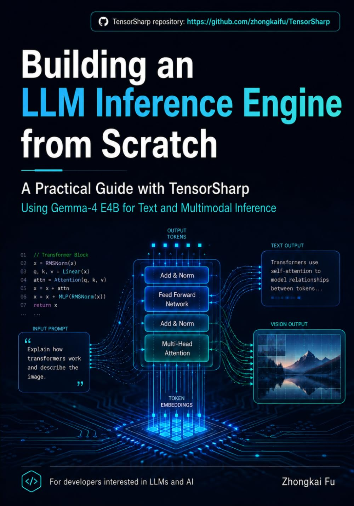
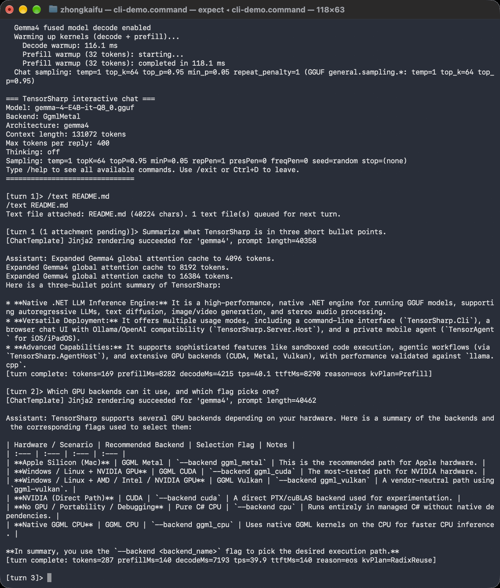
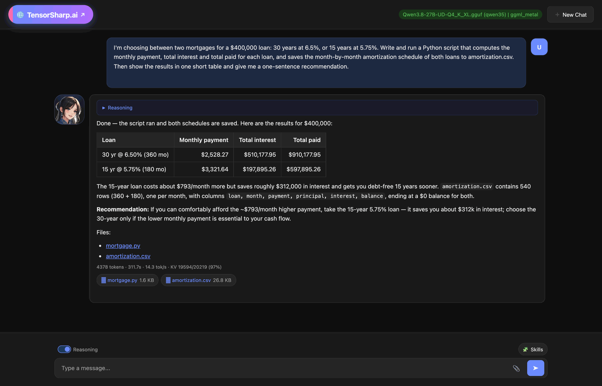
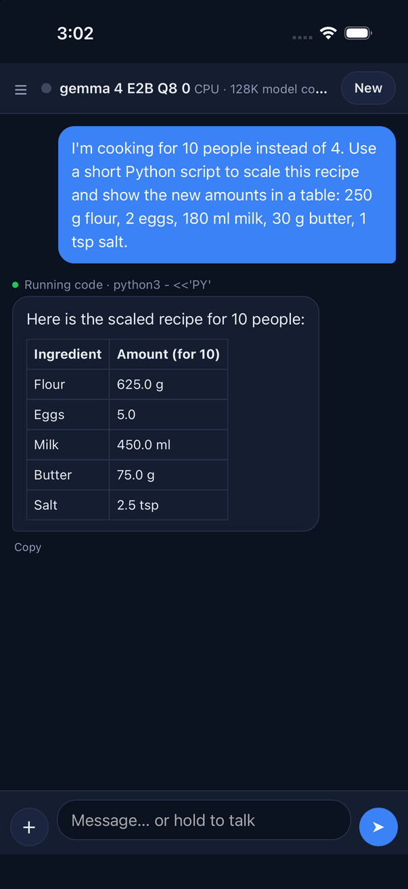
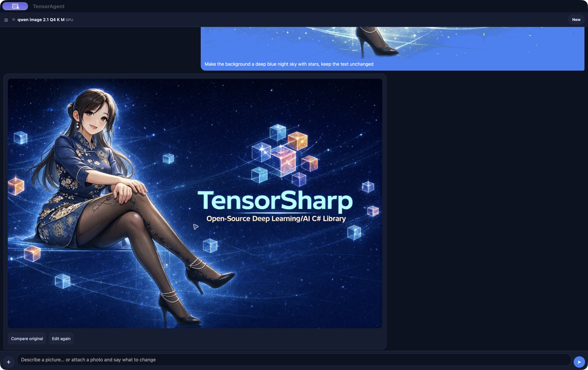

# TensorSharp

<p align="center">
  
</p>

[English](README.md) | [中文](README_zh-cn.md)

**面向 GGUF 模型的原生 .NET AI 推理引擎** —— 支持文本、推理、多模态输入、嵌入、图像生成与编辑，以及带音频的视频生成。可通过 CLI、浏览器聊天、兼容 Ollama/OpenAI 的 API，或运行在 iPhone、iPad、Mac 和 Windows 上的本地应用 [TensorAgent](TensorAgent/README.md) 使用。.NET 运行时提供纯托管 CPU 与原生加速后端；已发布的对比使用相同 GGUF 文件和硬件。可选的 `TensorSharp.AgentHost` 层还提供 Agent Skills、用于文件和 shell 操作的有界进程内“模型→工具”循环，以及有界的自动子智能体委派。

## 亮点功能

- **本地原生 .NET 推理。** 可通过 CLI、浏览器 Web UI，以及兼容 Ollama/OpenAI 的 API 运行 GGUF 文本与多模态模型。
- **模型与媒体覆盖广。** 当前源码支持现代文本模型、DiffusionGemma 文本扩散、视觉/音频输入、PDF、支持蒙版和 LoRA 插件的 [Qwen-Image-2.1 图像生成与编辑](docs/models/qwenimage21_zh-cn.md)、MiniMax-H3 视频与原生 32 kHz 立体声音频，以及 Wan 2.1/2.2 视频；详见[模型卡片](docs/models/README_zh-cn.md)。
- **文本与代码嵌入。** GGUF BERT/XLM-R 编码器，兼容 OpenAI/Ollama 的批量嵌入 API，支持 Snowflake Arctic Embed 与 MiniLM；见[嵌入指南](docs/embeddings_zh-cn.md)。
- **性能经过实测。** TensorSharp 在相同模型与硬件上对比 `llama.cpp`；结果对应所测的模型、后端与工作负载。详见[性能数据](docs/benchmarks_zh-cn.md)。
- **智能体工作。** `TensorSharp.AgentHost` 提供有界的 Agent Skills、代码工具与[自动子智能体委派](docs/multi_agent.md)（英文），子智能体拥有独立上下文、私有工作区、依赖调度，并默认只读。
- **手机与桌面上的 TensorAgent。** 同一个应用支持本地聊天、多模态输入、代码与文档工作、图像生成与编辑，以及带音频的短视频。内置十一项模型，按设备内存限制加载；图像和视频模型需要较高内存档位。界面支持英语、简体中文、繁体中文、日语、韩语、西班牙语、法语和德语。源码构建、平台差异及实际验证范围见 [TensorAgent](TensorAgent/README.md)。
- **可扩展的工程能力。** 连续批处理与分页、Radix 前缀共享 KV 缓存默认开启；投机解码、张量并行和可配置的安全边界按需启用。详见[功能说明](FEATURES_zh-cn.md)、[使用指南](USAGE_zh-cn.md)与[当前状态](docs/PROJECT_STATUS_zh-cn.md)。

## 支持的模型家族一览

- **文本、推理与多模态 LLM：** [DeepSeek V4 Flash](docs/models/deepseek4_zh-cn.md) / [V4.1 Flash](docs/models/deepseek41_zh-cn.md)、[GLM 5.x](docs/models/glm_zh-cn.md)、[Gemma 4](docs/models/gemma4_zh-cn.md)、[Qwen 3.5 / 3.6 / 3.8 27B](docs/models/qwen35_zh-cn.md)、[Qwen 3.8 Flash Next](docs/models/qwen38-flash-next_zh-cn.md)、[Bonsai2](docs/models/bonsai2_zh-cn.md)（Qwen 家族）、[GPT OSS](docs/models/gptoss_zh-cn.md)、[Nemotron-H](docs/models/nemotron_zh-cn.md)、[Mistral 3](docs/models/mistral3_zh-cn.md)、[Hunyuan Dense](docs/models/hunyuan-dense_zh-cn.md) 与 [Muse-Glimmer](docs/models/muse-glimmer_zh-cn.md)。
- **文本扩散：** [DiffusionGemma](docs/models/diffusiongemma_zh-cn.md)，包含 `/v1/systemone` 上的 [Jev 类型化判定](docs/models/jev_zh-cn.md)（支持文本、图像、上传文档、抽样视频帧，以及通过已配置 ASR 配套服务得到的语音转录）。
- **图像生成/编辑与视频生成：** [Qwen-Image-2.1](docs/models/qwenimage21_zh-cn.md)、[MiniMax-H3（视频 + 立体声音频）](docs/models/minimax-h3_zh-cn.md) 与 [Wan 2.1 / 2.2](docs/models/wan_zh-cn.md)。
- **文本与代码嵌入：** BERT / XLM-R 编码器——[Snowflake Arctic Embed L v2.0 与 all-MiniLM-L6-v2](docs/embeddings_zh-cn.md)。

各模型的后端、模态、功能支持与验证覆盖范围不同，详见[支持的模型](docs/supported_models_zh-cn.md)各表、[模型卡片](docs/models/README_zh-cn.md)及[嵌入指南](docs/embeddings_zh-cn.md)。

近期源码增加了 Qwen-Image-2.1 蒙版编辑：保留保护区域的精确像素，并可仅处理选中区域；TensorAgent 提供十二款加速、风格与编辑 LoRA 插件；Qwen3.8 Flash Next 可在 48 GB Mac 上使用 SSD 支持的权重路径运行。多 GPU 的 `--layer-split` 与 `--tp` 是独立选项，支持范围和性能取决于架构与量化格式。这些源码功能可能领先于已发布的 CLI / Server 包；TensorAgent 目前需要从源码构建。

## 配合书籍学习

| Qwen 推理与智能体运行时 | Gemma 4 与多模态推理 |
|---|---|
| <a href="https://www.amazon.com/dp/B0HJQ4VQ31"></a> | <a href="https://www.amazon.com/dp/B0H9P44QZZ"></a> |
| **[Building LLM Inference Engines and Agentic Runtimes from Scratch: Qwen Dense and MoE Models with TensorSharp and TensorAgent](https://www.amazon.com/dp/B0HJQ4VQ31)** | **[From Tensors to Tokens: Building a Multimodal LLM Inference Engine from Scratch with TensorSharp and Gemma 4 E4B](https://www.amazon.com/dp/B0H9P44QZZ)** |
| 使用 C# 构建 Qwen 稠密/MoE 推理与受控智能体工作流。从张量、分词、注意力、专家路由、量化和缓存，逐步走向 GPU 加速、多模态执行、工具、技能、沙箱代码执行，以及 TensorSharp 和 TensorAgent 的桌面与移动端部署。 | 以 Gemma 4 E4B 为例，用 C#/.NET 构建多模态推理引擎。从张量、GGUF 模型加载、量化与分词，走向文本、图像、视频和音频执行，并结合 TensorSharp 源码理解正确性检查与服务优化。 |
| **[在 Amazon 购买](https://www.amazon.com/dp/B0HJQ4VQ31)** | **[在 Amazon 购买](https://www.amazon.com/dp/B0H9P44QZZ)** |

**[查看两本书的介绍与仓库伴读路线](docs/BOOK_zh-cn.md)**

## 快速开始

更愿意使用预构建应用？[Releases 页面](https://github.com/zhongkaifu/TensorSharp/releases)提供自包含的 Windows x64（CPU/CUDA）、Linux x64（CPU/CUDA）与 macOS arm64 CLI / Server 归档。

从源码构建需要完整的 **.NET 10 SDK**（[各平台安装方法](docs/getting_started_zh-cn.md#安装与首次运行)）、`git`、`curl`、[CMake](https://cmake.org/download/) 3.20+，以及所选 GPU 的工具链。然后运行已验证的 [Gemma 4 E4B](https://huggingface.co/ggml-org/gemma-4-E4B-it-GGUF/blob/main/gemma-4-E4B-it-Q8_0.gguf) 模型（7.48 GiB）。在 Windows + NVIDIA GPU 上（PowerShell）：

```powershell
git clone https://github.com/zhongkaifu/TensorSharp.git; Set-Location TensorSharp
New-Item -ItemType Directory -Force models | Out-Null
curl.exe -L --fail "https://huggingface.co/ggml-org/gemma-4-E4B-it-GGUF/resolve/main/gemma-4-E4B-it-Q8_0.gguf?download=true" -o models\gemma-4-E4B-it-Q8_0.gguf
'用一句话回答：TensorSharp 是什么？' | Set-Content prompt.txt
$env:TENSORSHARP_GGML_NATIVE_ENABLE_CUDA = 'ON'
dotnet run --project TensorSharp.Cli -c Release -p:TensorSharpSkipMlxNative=true -- --model models\gemma-4-E4B-it-Q8_0.gguf --input prompt.txt --max-tokens 128 --backend ggml_cuda
```

在其他机器上换用对应后端（见[选择后端](#选择后端)）：

- **macOS（Apple Silicon）：** 去掉 CUDA 环境变量，使用 `--backend ggml_metal`。
- **Linux + NVIDIA：** 在 `dotnet run` 前加 `TENSORSHARP_GGML_NATIVE_ENABLE_CUDA=ON`，使用 `--backend ggml_cuda`。
- **AMD / Intel / NVIDIA Vulkan：** 设置 `TENSORSHARP_GGML_NATIVE_ENABLE_VULKAN=ON`，使用 `--backend ggml_vulkan`。

将同一模型作为服务托管：浏览器聊天在 <http://localhost:5000>，另有兼容 Ollama 与 OpenAI 的 API。

```bash
dotnet run --project TensorSharp.Server.Host -c Release -p:TensorSharpSkipMlxNative=true -- --model models/gemma-4-E4B-it-Q8_0.gguf --backend ggml_cuda --max-tokens 512
```

> 服务端监听 `0.0.0.0:5000`，没有内置鉴权或 TLS——请置于防火墙之后，或使用带鉴权的 HTTPS 反向代理。

### 选择后端

| 你的硬件 | 后端 |
|---|---|
| Apple Silicon（Mac） | `--backend ggml_metal` |
| Windows / Linux + NVIDIA GPU | `--backend ggml_cuda` |
| Windows / Linux + AMD / Intel / NVIDIA GPU | `--backend ggml_vulkan` |
| 无 GPU | `--backend ggml_cpu`（原生算子），或 `--backend cpu`（纯 C#，无原生依赖） |

其余内容见[快速上手指南](docs/getting_started_zh-cn.md)：各平台的 SDK 安装、多 GPU 与多节点运行、NVIDIA DGX Spark、多模态输入、嵌入服务，以及如何跑得更快。所有参数见 [CLI](USAGE_zh-cn.md#控制台应用) 与 [Server](USAGE_zh-cn.md#web-应用) 参考，两个程序也都可以用 `--help` 打印。

`dotnet build TensorSharp.slnx` 还会构建当前平台可用的 TensorAgent 桌面目标，以及 Apple Silicon 上的 iOS 模拟器目标；所选 SDK 须具备相应 MAUI 工作负载，且原生引擎与 Python 文件已准备好。缺少前置条件时，对应应用目标会被跳过并显示警告；见 [TensorAgent 构建说明](TensorAgent/README.md#build-and-run)。

## 实际运行效果

同一个引擎，四种用法，每张都是真实运行的原样截图。

<table>
  <tr>
    <td align="center" width="50%"><br><b>TensorSharp.Cli</b><br>在终端里运行模型</td>
    <td align="center" width="50%"><br><b>TensorSharp.Server.Host</b><br>Web UI 聊天与兼容 Ollama/OpenAI 的 API</td>
  </tr>
  <tr>
    <td align="center"><br><b>iPhone 上的 TensorAgent</b><br>在手机上运行模型的私有智能体</td>
    <td align="center"><br><b>桌面版 TensorAgent</b><br>使用 Qwen-Image 2.1 编辑图像，也可进行文本与智能体工作</td>
  </tr>
</table>

每次运行具体做了什么，见[实际运行截图](docs/showcase_zh-cn.md)。

## 性能数据

TensorSharp 与 `llama.cpp` 在同一块 NVIDIA RTX 3080 Laptop GPU（16 GB）上运行相同的 GGUF 文件，两个引擎均分别在 GGML CUDA 与 Vulkan 构建上测量。下表为在相同后端上 TensorSharp 相对 llama.cpp 的加速比（几何平均、单流、贪心采样、关闭 MTP）；大于 1.0× 表示 TensorSharp 更快。

| 模型 | 后端 | decode | prefill | TTFT |
|---|---|---:|---:|---:|
| Gemma 4 E4B it（Q8_0，dense 多模态） | CUDA | 1.02× | **1.28×** | **1.27×** |
| Gemma 4 E4B it（Q8_0，dense 多模态） | Vulkan | 1.00× | 1.05× | 1.03× |
| Gemma 4 12B it（QAT UD-Q4_K_XL，dense） | CUDA | 1.04× | **1.17×** | **1.16×** |
| Gemma 4 12B it（QAT UD-Q4_K_XL，dense） | Vulkan | **1.21×** | 1.04× | 1.03× |
| Qwen 3.6 35B-A3B（UD-IQ2_XXS，MoE） | CUDA | 0.98× | **1.28×** | **1.27×** |
| Qwen 3.6 35B-A3B（UD-IQ2_XXS，MoE） | Vulkan | 0.87× | 1.04× | 1.03× |
| Qwen 3.6 27B（UD-IQ2_XXS，dense） | CUDA | **1.07×** | 0.96× | 0.95× |
| Qwen 3.6 27B（UD-IQ2_XXS，dense） | Vulkan | 1.02× | 0.85× | 0.84× |

这些数字的含义、如何复现，以及放不进这块 GPU 的大模型的正面对比，见[性能数据](docs/benchmarks_zh-cn.md)。

## 文档

初次使用？上面几节足以让你跑起来。其余均为详细参考：

| 文档 | 内容 |
|---|---|
| [TensorSharp 与 TensorAgent 书籍指南](docs/BOOK_zh-cn.md) | 《Building LLM Inference Engines and Agentic Runtimes from Scratch》与《From Tensors to Tokens》：书籍介绍、Amazon 链接与仓库伴读路线 |
| [快速上手指南](docs/getting_started_zh-cn.md) | 完整的首次运行指南：各平台的 .NET SDK、所有后端、多 GPU 与多节点运行、NVIDIA DGX Spark、嵌入服务、后端选择与提速 |
| [支持的模型](docs/supported_models_zh-cn.md) | 已实现的模型家族与实际验证范围：示例 GGUF、模态、思维链、工具与投机解码 |
| [性能数据](docs/benchmarks_zh-cn.md) | 在相同 GPU 与相同文件上对比 llama.cpp，以及更大模型的正面对比 |
| [实际运行截图](docs/showcase_zh-cn.md) | CLI、Web UI，以及 iPhone 与 Mac 上的 TensorAgent 的实际运行截图，及每次运行做了什么 |
| [模型下载](MODEL_DOWNLOADS_zh-cn.md) | 各模型 `huggingface-cli` 下载 + 运行速查（量化档位、投影器、伴随文件） |
| [使用方法](USAGE_zh-cn.md) | 完整 CLI 参考（选项、交互式 REPL、JSONL 批处理）、服务端托管、日志、HTTP API 示例、后端与环境变量矩阵 |
| [功能特性](FEATURES_zh-cn.md) | 连续批处理、投机解码、工具调用、思维链、多模态、MoE、KV 编解码等深入说明 |
| [配置文件](config/README.md) | 把参数写进可复用的 JSON 文件，支持 `${变量}` 与模型自动下载 |
| [开发](DEVELOPMENT_zh-cn.md) | 前置要求、构建原生 GGML/MLX 库、仓库结构、包分层、内部架构与测试工具 |
| [按模型架构卡片](docs/models/README_zh-cn.md) | 各架构端到端文档（前向图、组件、参数、prefill/decode 优化） |
| [分页注意力 & 连续批处理](docs/PAGED_ATTENTION_AND_CONTINUOUS_BATCHING_zh-cn.md) | vLLM 风格的分页 KV 缓存、前缀共享与迭代级调度器 |
| [Agent Skills 与智能体工作](docs/agent_skills.md)（英文） | `SKILL.md` 格式、渐进式披露与其预算、进程内工具循环、沙箱化代码执行、工作区与产物、路径 / ZIP / 执行安全模型，以及 HTTP 与 C# 两套接口 |
| [多智能体](docs/multi_agent.md)（英文） | 自动任务委派、隔离的子上下文、并发与权限限制、服务端控制项，以及可复现的评测 |
| [浏览器自动化技能（Playwright）](docs/playwright_agent.md)（英文） | 运行内置的 `playwright` 技能（经 `skills_run` 通过 `@playwright/cli` 驱动浏览器）：所需参数、macOS 上的 Chromium 沙箱配置、账号交接，以及 TensorAgent 桌面托管（不支持 iOS） |
| [投机解码](docs/speculative_decoding.md)（英文） | 三层设计（模型适配层 / 算法 / 草稿权重）、已内置的 `auto` / `draft-head` / `block` / `ngram` 四种算法，以及新增一种算法需要写什么 |
| [环境变量功能矩阵](docs/env_var_feature_matrix_zh-cn.md) | 哪些高影响运行时开关影响哪些模型、后端与提示类型 |
| [引擎对比报告](docs/engine_comparison_report.md) | TensorSharp 对比 llama.cpp 的完整逐场景表格 |
| [ggml_metal 对比 llama.cpp](docs/perf/metal-vs-llama-cpp.md) | Apple Silicon 上 prefill / decode 的正面对比，找到的四处计算图构建差距，以及每一处的实际收益 |
| [测试 / 基准矩阵运行器](TensorSharp.TestMatrix/README_zh-cn.md) | 扫描 model × backend × feature × env-var 组合并生成回归报告 |
| [服务端 API 示例](TensorSharp.Server.Host/API_EXAMPLES_zh-cn.md) | 完整的 curl 与 Python 示例 |

## 当前状态

仍在活跃开发中，源码树领先于已发布的包。

| 范围 | 当前情况 |
|---|---|
| 模型 | 十余个自回归家族，另有文本扩散、图像生成与编辑，以及带音频的视频生成。见[支持的模型](docs/supported_models_zh-cn.md)。 |
| 推理宿主 | CLI、Web UI、兼容 Ollama 与 OpenAI 的 API，以及 iPhone、iPad、Mac 和 Windows 上的 TensorAgent 应用。TensorAgent 目前仅提供源码构建。 |
| 后端 | 纯 C# CPU、Direct CUDA/cuBLAS、MLX Metal，以及 GGML CPU/Metal/CUDA/Vulkan，各架构另有例外。 |
| 服务能力 | 带共享前缀缓存的连续批处理、投机解码、张量并行、结构化输出与工具调用。 |
| 智能体能力 | Agent Skills、沙箱化的文件与 shell 工具，以及有界的子智能体。见 [Agent Skills](docs/agent_skills.md)（英文）与[多智能体](docs/multi_agent.md)（英文）。 |
| TensorAgent | 十一项内置模型、保存聊天与产物、蒙版图像编辑和 LoRA 选择、八种界面语言，以及持久保存的文本轮次统计。媒体生成已在 Mac 上实测；iOS 媒体生成及 Windows 图像 / 音频 / 视频生成仍未验证。 |

逐项细节（哪个架构跑在哪个后端上、各家族分别支持哪些特性，以及已知限制）见[状态矩阵](docs/PROJECT_STATUS_zh-cn.md#状态矩阵)。

## 作者

Zhongkai Fu

## 许可证

详见 [LICENSE](LICENSE)。
