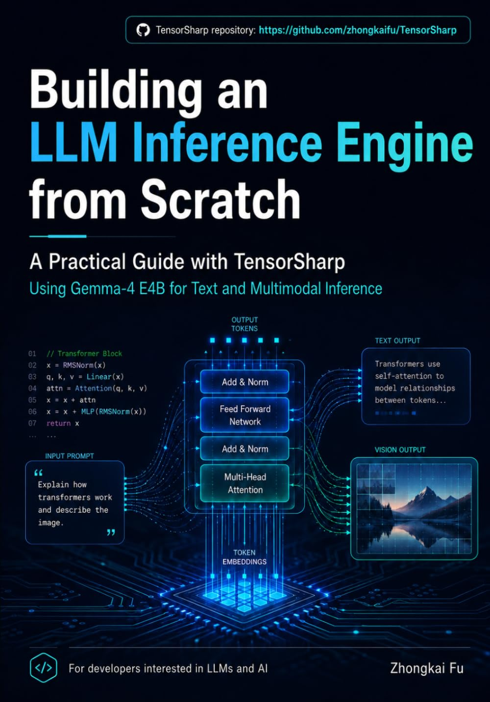

# From Tensors to Tokens: Building a Multimodal LLM Inference Engine from Scratch with TensorSharp and Gemma 4 E4B

[← Back to TensorSharp](../README.md) | [English](BOOK.md) | [中文](BOOK_zh-cn.md)

  

<strong><a href="https://www.amazon.com/dp/B0H9P44QZZ">Buy the paperback on Amazon</a></strong>

## A guided path through a real inference engine

TensorSharp's reference documentation is organized so you can quickly look up a model, backend, command, or optimization. **From Tensors to Tokens** supplies the complementary narrative: a continuous journey from tensor foundations to a working multimodal LLM inference engine, using TensorSharp and Gemma 4 E4B as the concrete example.

The book is for readers who want to understand how the pieces fit together—not only how to run a command. Follow the data from inputs to tensors and tokens, through model execution and generation, and out to the CLI, browser UI, and compatible HTTP APIs. Keep this repository open beside the book to inspect the implementation, run the examples, and continue into the latest project documentation.

## Book details

| Detail | Value |
|---|---|
| Author | Zhongkai Fu |
| Format | Paperback |
| Length | 128 pages |
| Language | English |
| Publication date | July 18, 2026 |
| ISBN-13 | 979-8187878703 |
| Example model | Gemma 4 E4B |
| Companion project | TensorSharp |

## What the learning path connects

- **Tensor foundations to model operations** — build a practical mental model for the data structures and computations that drive inference.
- **Tokens to generation** — connect model inputs, embeddings, forward execution, sampling, and autoregressive output.
- **Text to multimodal inference** — use Gemma 4 E4B as the example that brings text, image, video, and audio paths into one engine.
- **Architecture to acceleration** — relate the model implementation to CPU and GPU backends, GGUF weights, quantized execution, and performance-oriented paths.
- **Engine to application** — see how the same runtime becomes a command-line tool, browser experience, and Ollama/OpenAI-compatible service.

## Read the book alongside the repository

| Reading goal | Live companion |
|---|---|
| Run the example model | [TensorSharp Quick Start](../README.md#quick-start) |
| Choose and download Gemma 4 E4B files | [Model Downloads](../MODEL_DOWNLOADS.md) |
| Inspect the model end to end | [Gemma 4 architecture card](models/gemma4.md) |
| Understand tensors, packages, and engine layers | [Development and architecture guide](../DEVELOPMENT.md) |
| Explore multimodal, batching, tools, and inference features | [Feature guide](../FEATURES.md) |
| Use the CLI, server, and compatible APIs | [Usage guide](../USAGE.md) |

The repository evolves after publication, so use its current reference pages for the newest supported models, flags, backends, and benchmark results. The book remains the compact, guided route through the ideas and their assembly into a complete system.

## Who it is for

- .NET and C# developers who want to move beyond calling hosted AI APIs.
- Students and self-directed learners looking for a concrete path through LLM inference.
- ML engineers who want to connect model architecture with systems implementation.
- Technical leaders evaluating what an understandable, locally operated inference stack contains.

## Get the book

Ready to follow the full path from tensors to tokens?

**[View From Tensors to Tokens on Amazon](https://www.amazon.com/dp/B0H9P44QZZ)**

